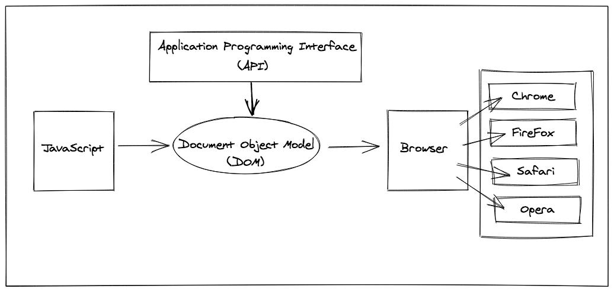

## **Document Object Model**
---

- **Document Object Model (DOM):** specifies how browsers should create a model of the HTML page and how JavaScript can access and update the web page contents

- **Application Programming Interface(API):** used to allow programs to interact with one another, the DOM is an application programming interface

- **DOM Tree:**
- Nine different types of node objects
- Four main types of nodes:
  - Document Node: represents the entire page, starting point for all visits to the DOM tree
  - Element Node: part of the structure of the HTML page
  - Attribute Nodes: part of the element in the opening tags of HTML elements 
  - Text Nodes: text contained within an HTML element, text nodes cannot have child nodes and are always a new branch with no further branches coming off of it

- **DOM Queries:**
  - may return individual elements
    - `getElementById('id')`
    - `querySelector('css selector')`
      - returns only the first match
  - return a Nodelist (one or more elements)
    - `getElementsByClassName('class')`
    - `getElementsByTagName('tagName')`
    - `querySelectorAll('css selector)`
      - returns all matches

- **NodeList:**
  - type of object called a **collection** of element nodes 
  - each node is indexed (zero-indexed)
  - stored in the order they appear in the HTML page
  - can be stored in a variable
    - Live NodeList 
      - updated when the script updates the page
      - `getElementsby` return live NodeLists
      - generate faster than static NodeLists
    - Static NodeList
      - not updated to reflect changes made in a script
      - `querySelector` returns static Node

  **Properties and Methods of NodeLists**  
  - Property  
     - `.length` - returns number of items in the NodeList   
  - Method
    - `item()` returns a the node corresponding to the index number in the parentheses
    - array syntax to retrieve NodeList items (more common and preferred because it is faster)

**Traversing the DOM**
 - selecting an element relative to current element node
 - Five properties
   1. `parentNode`
      - finds element node containing the present HTML element
   2. `previousSibling`
      - finds previous sibling of a node
   3. `nextSibling`
      - finds next sibling of a node
   4. `firstChild`
      - finds first child of a node
   5. `lastChild`
      - finds last child of a node

- Properties 2 through 5 can be affected by text nodes added in some browsers to create whitespace
- use jQuery to address these inconsistencies

**Accessing/Updating Element Content**
- technique for changing content dependent upon element type 

##### Working with Text Nodes:
- use `nodeValue`: accesses text from node
  - must be on a text node, not the text's containing element

##### Working with Element Nodes:
- Either:
  - retrieve (get) markup
  - update (set) markup
    - new content will overwrite both text and markup of the element
- use `textContent`: get/set text only
- use `innerText`: get/set text only (avoid using this)
- use `innerHTML`: get/set text *and* markup

#### Adding/Removing HTML Content
1. `document.write()`
  - simple way to add content not in the original source code
  - easy way to show beginners how to add content to the page
  - only works when the page initially loads
  -  is rarely used
2. `element.innerHTML`
    - poses security risks 
    - better suited for updating entire fragments 
  - first create a variable with the replacement markup
  - then select the element with content to update
  - last update the content with the new markup
  - to remove content create a variable with an empty string

3. DOM Manipulation  
   - requires more code and can be slower
   - easily targets individual nodes in the DOM tree

  - first create the new text node
  - then create the new element node
  - add the new text node to the new element node
  - select the element where the new fragment will go
  - append the new fragment to the selected element

## Events
---
- registered as objects with associated propeties and methods
- user interactions and browser manipulations programmed to trigger functionality  
  *Examples:*
    - `.onclick` : mouse clicking on a button

    - webpage files loading in the browser
    - swiping right on an image

#### Event Handler functions
 - modify and update DOM elements after an event fires.
 - property of the event object
 - `.addEventListener()`
   - waits for a specific event to occur and calls a named event handler function to respond to it 
   - requires two arguments:
     -  event type as a string
     -  event handler function
  - allows multiple event handlers to be registered to a single event without changing its other event handlers
- `.removeEventListener()`
  - stops the code from “listening” for an event to fire when it no longer needs
  - passes two arguments:
     - event type as a string
     - event handler function
  - must match the function that was passed to `.addEventListener`

#### Event Object Properties:
 - `.target`
    - the DOM element being interacted with
    - passes two arguments:
      - event type as a string
      - event handler function
- `.type`
  - used to access the name of the event
- `.timeStamp`
  - access the number of milliseconds that passed since the document loaded and the event was triggered
- Mouse events:
   - `.click`
   - `.mousedown`
   - `.mouseup`
   - `.mouseover`
   - `.mouseout`
- Keyboard Events
  - `.keydown`
  - `.keyup`
  - `.keypress` (user press *and* releases key)
  - have unique properties assigned to their event objects

