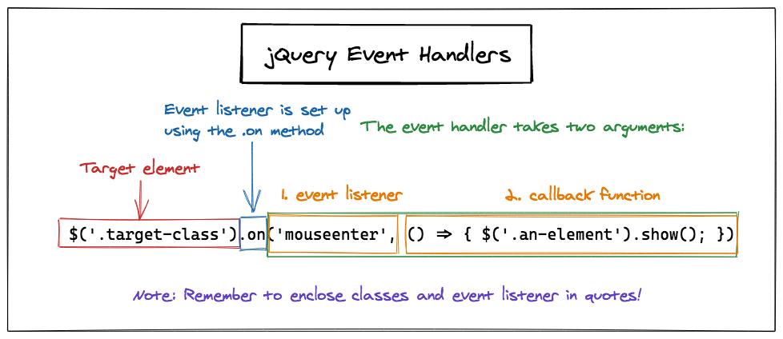

# **jQuery**


#### Syntax 
 - `$` symbol is an alias for the `jQuery` function

 - `$` symbol and `jQuery` are interchangeable

 - `jQuery` function takes a parameter that targets an element
 - turns it into a `jQuery` object
 - call any `jQuery` method on a `jQuery` object

 -  `jQuery` objects are often saved in variables  

    - *Example:*  
 `const $jQueryExample = $('.sampleClass');`

 - best practice to name `jQuery` objects with a leading `$` to indicate that the variable is a `jQuery` object

 - call the `jQuery` method on the `jQuery` object inside the variable
  - *Example:*  
 `const $jQueryExample = $('.sampleClass').method;`

 
#### Methods:

Pre-made JavaScript structures used to add dynamic behavior

### ***Examples:***

- effect methods: 
  - Demo @ CodePen:
    -  [jQuery Show/Hide/Fade/Toggle Effects](https://codepen.io/Kirsten_B/pen/bGVMQaj)

  - `.animate()`  
  - `.delay()`  
  - `.fadeIn()/.fadeOut()`  
        - transition between being visible and invisible happens over a duration of time, similar to animation
  - `.fadeToggle()` 
        - a hidden element will fade in, a visible element will fade out
  - `.hide()`
    - browser will render the HTML as if the hidden element does not exist
    - space that it was taking up will disappear
  - `.show()`  
    - will make a hidden element re-appear
  - `.toggle()`
    - will either hide or show elements depending on their current state  
  - `.slideDown()/ .slideUp()` 
    - an element slides up or down into place 
    -  have an optional parameter to determine how long the animation will take
- event methods:

    - `.change()`  
    - `.click()`  
    - `.focus()`  
    - `.hover()`  
    - `.keydown()/.keyup()/.keypress()`  
    - `.mouseenter()/.mouseleave()`  
    - `.on()`  
        - adds event handlers to jQuery objects

        - takes two parameters: 
            - string declaring the event to listen for (the handler)
            - a callback function to fire when the event is detected
    - `.ready()` 
        - waits until the browser finishes rendering the HTML document before triggering a callback function
        - write all of our jQuery behavior inside this callback function. 

        - *Example:*  
    ```
        $(document).ready(() => {
            // Code goes here
        });
    ```
     
-  DOM manipulation methods:

    - `.addClass()/.toggleClass()` 
    - `.after()/.before()`  
    - `.append()/.prepend()`   
    - `.remove()`  
    - `.val()`


## Targeting by Class

- `.document`
    - special keyword used to target the HTML document and create a `jQuery` object

- `$()` syntax
   - used to create `jQuery` objects for elements on a web page
   - pass a string into the `$()` to target elements by id, class or tag
   - prepend the class name with a period  
        - *Example:* `('.className')`
   - use `.` notation to attach a handler method that triggers a callback function

- classes can be targeted with multiple elements at once

## Targeting by id

- prepend the element’s id name with the `#` symbol
    - - *Example:* `('#idName')`

## Event Handler
- links a user event (such as a mouse click) to a visual effect
- consists of two parts:
  1. **Event listener**
     - listens for a specific user event
  2. **Callback function**
     - function executed when event listener is triggered

Example first Arguments for Mouse Events:
 - `'click'`
 - `'mouseenter'`
 - `'mouseleave'`


 


