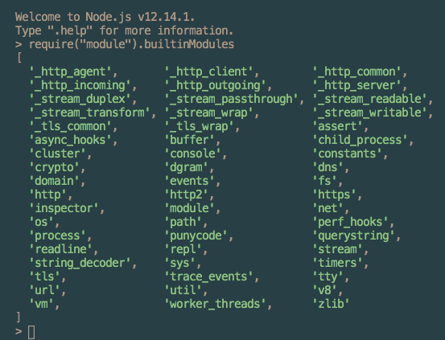

# Node.js
- off-browser JavaScript environment invented by Ryan Dahl in 2009
- JavaScript runtime
  - environment that allows execution of JavaScript code outside of the browser
  
**Runtime:** converts code written in a high-level, human-readable, programming language and compiles it down to code the computer can execute  


## REPL
- abbreviation for Read-Evaluate-Print Loop
- program that loops through three different states:
  - **read** state where the program reads input from a user
  - **eval** state where the program evaluates the user’s input
  - **print** state where the program prints out its evaluation to a console
  - **loops** through these states again


## JavaScript REPL
- built-in upon Node installation
- access by typing `node` into the terminal
- `>` character at prompt indicates the REPL is running
- indicate the input is ready for eval when you hit `enter`
- for evaluation of multiple lines type `.editor` after the prompt and type `control D` when the input is ready to be evaluated
- each session is a single shared memory, variables and functions are accessible until the REPL is exited

## Node-specific Global Objects
- Node environment contains Node-specific global elements in addition to the JavaScript global elements

### JavaScript Global Objects Lists:  

[MDN: Standard built-in objects](https://developer.mozilla.org/en-US/docs/Web/JavaScript/Reference/Global_Objects)

[Node: Node.js v14.4.0 Documentation- Global Objects](https://nodejs.org/api/globals.html)

List all global objects in Node: (this might be long due to the size of the process object)

```
> global

// returns:

Object [global] {
  global: [Circular],
  clearInterval: [Function: clearInterval],
  clearTimeout: [Function: clearTimeout],
  setInterval: [Function: setInterval],
  setTimeout: [Function: setTimeout] {[Symbol(util.promisify.custom)]: [Function] },
  queueMicrotask: [Function: queueMicrotask],
  clearImmediate: [Function: clearImmediate],
  setImmediate: [Function: setImmediate] {
    [Symbol(util.promisify.custom)]: [Function]
  }
}
```

List only the keys for all the global objects:

```
> Object.keys(global)  

// returns:
[
  'global',
  'clearInterval',
  'clearTimeout',
  'setInterval',
  'setTimeout',
  'queueMicrotask',
  'clearImmediate',
  'setImmediate'
]
```
Since the global object behaves like any other object, it is possible to add methods and properties to it.

*Example:*

```
// add a property of pet

global.pet = 'cat'

// log the value of the new property:

console.log(global.pet)

// returns the value of the new property:
cat

```

---
## Running a Program in Node
1. Create a file with a `.js` extension
2. Open that file with a text editor and add code to the file
3. Open the terminal and navigate to the directory containing the file to run
4. Type node and then the file name.js into the terminal
5. The results of the program will print to the terminal
---

**Process:** the instance of a computer program that is being executed

#### `process.env`
- global process object in node that stores and controls information about the environment
- may have `if/else` logic to perform tasks when the process isn't live to users  


 
*Example:*

`PWD` 
- holds a string indicating the directory with the location of the current process

*Example:*
- add a property with key of `NODE_ENV` to `process.env` 
- insert value of either `production` or `development`

```
if (process.env.NODE_ENV === 'development'){
  console.log('Testing! Testing! Does everything work?');
}
```
*Example:*  

`process.memoryUsage()` returns information about the CPU demands of the current process

**Heap:** a block of computer memory
- can also be a data structure

*Example:*

`process.memoryUsage().heapUsed` returns a number representing bytes of memory the current process is using

*Example:*  
`process.argv` holds an array of command line values for when the current process was initiated
  - first element is the absolute path to Node
  - second element is the path to the file currently running
  - following elements are command line arguments provided when the process was initiated
---
Full documentation is here:  
[Process Object Documentation: Node.js v14.4.0 Documentation](https://nodejs.org/api/process.html) 

Node.js vs Core modules and Local Modules:
---
**Modularity:** software design technique where one program has distinct parts each providing a single piece of the overall functionality
- essential for creating scalable programs which incorporate libraries and frameworks 
- separate the program’s concerns into manageable chunks

**Module:** module is a collection of code located in a single file
- distinct part providing a single piece of the overall functionality

`require()` - function used to combine modules into a complete program
- can use either core modules or functions created by the programmer
  - first checks if the argument is a core module
  - then, if not a core module, attempts to locate it elsewhere
    - local modules are required by passing in the path to the module (file)

**Core Modules:** modules included in the Node the environment to efficiently perform common tasks
- located in the `lib/folder`
- required by passing a string with the name of the module into the `require()` function

Viewing the Node.js core modules:  




`module.exports` : special JavaScript object in each JavaScript file in the Node environment
- holds everything in the file (a module) that is available for other files to `require()`

## Node Package Manager (NPM):  
-online collection, or registry, of software written and shared by other developers
- includes frameworks like `express` or `react`

**nodemon:** tool that helps develop node.js based applications by automatically restarting the node application when file changes in the directory are detected.  
[Website: nodemon](https://www.npmjs.com/package/nodemon)

## Event Driven Architecture  

**Imperative programming:** give the computer a series of instructions to execute in a pre-defined order

**Web Applications:** need to write logic to handle situations without knowing exactly when they’ll occur

- Node applies event-driven principles to the back-end environment

`EventEmitter` class: accessed by `require()` from the `events` core module
- each `EventEmitter` instance has an `.on()` method that assigns a listener callback function to a named event
  - `.on()` method takes two arguments:
     1. Name of the event as a string
     2. Listener callback function 

*Example:*   
```
myEmitter.on('new user', newUserListener)
// .on() method
// 'new user' is the event string
// newUserListener is the callback function
```

- each EventEmitter instance also has an .emit() method to announce a named event has occurred
  - `.emit()` method takes two arguments:
    1. Name of the event as a string
    2. Data that should be passed back into the listener callback function  

*Example:*   
```
myEmitter.emit('new user', 'John MacIntyre')
// .emit() method
// 'new user' is the event string
// 'John MacIntyre' is the data passed into the callback function
```    

## Asynchronous JavaScript with Node.js
- use and event loop enables asynchronous actions to be run in a non-blocking way
### Node APIs for asynchronous tasks
  - expect callback functions to be passed as arguments
  - trigger subscription and emitting of events to signal the completion of the operation
  - upon operation completion, the callback function is added to the queue of tasks awaiting execution
  - once the current stack--the synchronous tasks-- is completed the operations on this queue will be performed

Note: if the synchronous tasks never complete, the operations in the queue never execute

### Modern Handling of asynchronous tasks:
- `Promises`
  - newer versions of Node provide asynchronous APIs formatted for promises
  - under `util.promisify`
- `async...await`

## User Input/Output
- input: data provided to the computer
- output: any data or feedback provided by the computer

### Output
`console.log()` : is 'thin wrapper' on the `.stdout.write() `method of the `process` object  

`stdout` : stands for standard output

### Input
`stdin.on()` : receives input from a user through the terminal on the process object
`process.stdin` : is an instance of an EventEmitter

- input read through the terminal is received as a `Buffer` object with a new line character at the end

## Errors

Standard JavaScript errors in Node:  
- `EvalError`  
- `SyntaxError`   
- `RangeError`  
- `ReferenceError`  
- `TypeError`  
- `URIError ` 
- `Error` class: for creating new error instances

`throw` : occurs when errors are generated in code  
`try...catch` statements: error handling techniques in synchronous code within Node

**Error-first callback functions:** callback functions with the error as the first expected argument and the data as the second argument
- used by many asynchronous Node APIs
- if the asynchronous task produces an error it is passed as the first argument to the callback function
- if no error is produced, the first argument is undefined


## Filesystem

**Sandboxing:** technique of isolating applications from each other to protect users from malicious programs and invasions of privacy

- all data on a computer is organized and accessed with a filesystem
- script should have limited access to the user's filesystem
- less restricted interaction with the filesystem is necessary for back-end

### `fs`
- core module which is an API for interacting with the file system
- modeled after POSIX standard for interacting with a file system
- each `fs` method has a synchronous and an asynchronous version
- `.readfile()` : method to read data from a provided file


## Readable Streams
- stream: data processed piece by piece instead of all at once
  - conserves RAM
  - don't need all of the data on hand to begin processing it

- `.createInterface()` method from `readline` core module
   - reads and writes to files line-by-line
   - `.createInterface()` returns ane `EventEmitter` set up to emit `line` events


## Writable Streams
- `fs.createWriteStream()` - used to create a writeable stream

- writeable stream can remain open indefinitely
- can indicate the end of the writeable stream with the `.end()` method


## Create an HTTP Server with Node
- web server: computer process that listens for requests from clients and returns responses

- `http` module : core module used to create web server

- `http.createServer()` method
  - returns an instance of an `http.server`
  - `.listen()` : causes the server to listen for incoming connections
  - when running `http.createServer()` method a custom callback function is passed in (often called `requestListener`)
  - `requestListener` is triggered when the listening server receives a request

### requestListener callback function
- expects two arguments:
  - request object
  - response object

- is invoked when a request is made to the server
   - passes in the request and response objects

- requests and responses have their own properties and methods, which can be accessed via the request object passed in

- sets the response header and body

- signals that the interaction is complete with `response.end()` method


### Node is primarily made up of JavaScript and the event loop

- the event loop waits for events and dispatches them when they occur
- JavaScript and Node are each only one thread
- Node takes all requests and delegates them to their tasks
  - when task are complete those programs emit events to callbacks registered to the event
  - callbacks: functions passed to other functions as arguments to be called under certain conditions

---
## Heroku Tutorial

- Check status of node and npm (make sure they are installed and what version I am running)
   - `node -v`
   - `npm -v`

- log into Heroku using the CLI (command line interface)
  - `heroku login`
  
  Unedited notes (to be cleaned up later):
  Steps I performed today:

1. Checked status on node -v, npm -v
2. Logged into my Heroku account and the Heroku CLI (command line interface)
3. Cloned demo app after deleting failed app from my user directory, changed to that directory
4. Created Heroku app 'damp-springs-61424 and deployed my code to the app. Viewed the live app on Chrome browser
5. Viewed logs of visits to the app in the browser
6. Viewed the Profile and understand the meaning of the web process
7. Scaled the dynos up and down on the sample web app
8. Install dependencies for local app with npm install. Generated package-lock.json file
9. Ran Heroku locally using the  http://localhost:5000 location on my browser
10. Added a dependency to the package.json file, required the dependency in the index.js file. Tested the new dependency locally. Deployed the dependency to Heroku using the git procedure.
Deploy sequence:
  Git add .
  Git commit -m "comment goes here"
  Git push Heroku master
  Heroku open (new page)
11. Provisioned the paper trail logging add-on. Viewed the log events in the browser.
12. Ran bash on my dyno
13. Modified config vars, deployed to Heroku, and opened times to view two numbers
14. Added the free Heroku Postgres Starter Tier dev database to the app. Added node-postgres to dependencies. Connect the database to the index.js file.

