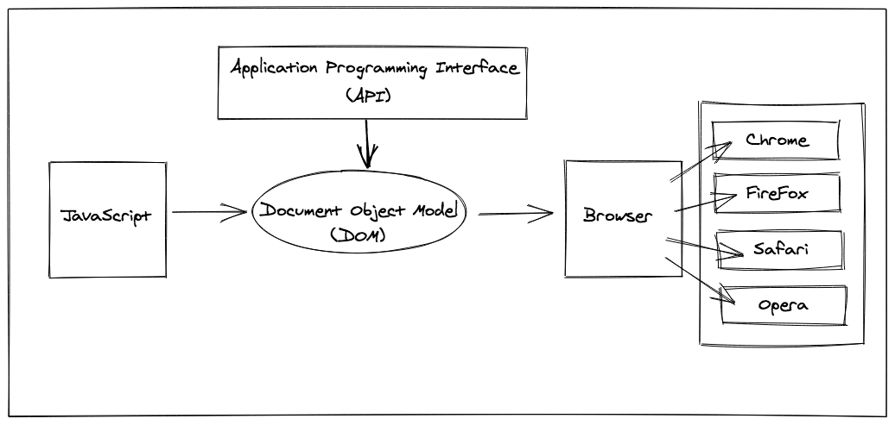

## How Computers Represent our World: (Jon Duckett)
- Computers creates models of the world with data
- Models use Objects to represent physical things
 Objects have:
  - Properties that tell us about the object
  - Methods: perform tasks utilizing the properties of the object
  - Events: triggered when a user interacts with the computer  


## Terms and Concepts
- **Expression:** 
  - a piece of code that can be evaluated to produce a single value
  - sometimes enclosed in parentheses (depending on preference)

- **Statement:** 
  - corresponds to a full sentence, ends with a semi-colon, 
  - a piece of code that can be executed and performs some kind of action.
  *Examples:*
    - `if` statement
    - `if` ... `elseif` ... `else` statement
    - `switch` statements
      - better performance then a series of `if` statements since the `break` keyword stops the rest of the statement from running

- **Program:** a list of statements made up of expressions
- **Environment:** the collection of variables and values that exist at a given time

- **Stack:** data structure that allows a programmer to push values into it and pop them out in the opposite order, the element that was added last is removed first

- **Object:** values that consist of arbitrary collections of properties 


- **Function:** a piece of a program wrapped in a value, a reusable block of code that can accept input  and groups together a sequence of statements to perform a specific task, doesn't end with a semi-colon

- **Higher-Order Function:** accepts other functions as arguments and/or return functions as output, 
  - gives programmers the ability to build **abstractions**
  - allows more modular code

- **Parameters:** allow functions to accept input(s) and perform a task using the input(s), placeholders for information that will be passed to the function when it is called, act like variable names inside the function

- **Default Parameters:** allow parameters to have a predetermined value in case there is no argument passed into the function or if the argument is `undefined `when called

- **Arguments:** values that are passed to the function when it is called

- **Block:** code found inside a set of curly braces `{}`

- **Helper Functions:** functions being called within another function using the return value of the first function

- **String Interpolation:** Using template literals to embed variables into strings

- **Scope:** the part of the program to which the binding is visible, the context in which the variables are declared

- **Block:** section of code enclosed within curly braces `{}`

- **Block Scope:** scope available to code enclosed by curly braces, allows variables to be defined with precision

- **Local variable:** only available to code that is part of the same block

- **Scope Pollution:** too many variables in the global namespace or reusing variables across different scopes, take up more memory than local objects and slows performance

- **Separation of Concerns (SoC:** the practice of separating code into different files, makes each 'concern' easier to understand and makes changing code more convenient

- **Method:** a function that is created in and part of an object

- **Calling Object:** object that a method (function) belongs to

- **Type Coercion:** converting data type behind the scenes to complete an operation

- **Document Object Model (DOM):** specifies how browsers should create a model of the HTML page and how JavaScript can access and update the web page contents
  - the browser's internal representation of a web page
  - the link between an HTML web page and scripting languages



- **Application Programming Interface(API):** used to allow programs to interact with one another, the DOM is an application programming interface

- **JSON:** JavaScript Object Notation, organized format that matches values to types of information  

- **Node.js:** open source server environment

- **Pass-by-Reference:** when passing an array into a function, if the array is mutated inside the function, that change will be maintained outside the function as well, changing the variable's memory (array element?) by passing a reference to it, arrays mutated inside of a function will keep that change even outside the function

- **Sandboxing:** when browsers limit the things a JavaScript program may do such as looking at the files on your computer or modifying anything not related to the web page it was embedded in 
 
- **Events:** user interactions and browser 
manipulations on the document object model

- **First Class Objects:** objects that have both properties and methods

---

## How to use node.js in the terminal:

- type `node -v` and return to get the version of node installed on the computer
- type `node` to enter the node program
- type the javascript commands into terminal and return to see the result. 
Example:
```
> const num = 10;
undefined
> 
> console.log(num);
10
undefined
```
Example:
```
let num1 = 16;
undefined
> console.log(num1);
16
undefined
> console.log(num1 +=1);
17
undefined
> console.log(num1 +=3);
20
```
---
### REPL
- REPL stands for :
  - Read
  - Evaluate
  - Print
  - Loop

---


