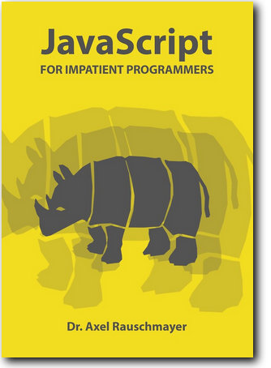

# Heading Text
## Heading Text
### Heading Text
#### Heading Text
##### Heading Text
###### Heading Text

*This text is italicized*

**This text is bold**

> Blockquote paragraphs must have
> a right-arrow bracket at the start
> of every single line.
>
> Use a blank line for multiple paragraphs.

- Bullet list item
- Bullet list item
- Bullet list item
  - Use a two-space indent for nested lists


1. Bullet list item
2. Bullet list item
3. Bullet list item
   1. Ordered lists can also be nested


1. Can you mix list types?
    
   - Yes, you can! 

---
***
___

Note: Either three hyphens, asterisks, or underscores.

This is an [example link](//www.makeuseof.com)




Prefix Markdown characters with \*backslashes\* to ignore formatting.

`This is inline code`

```
This is a block of code
It supports multiple lines
```

~~This text is crossed out~~

This is some text\
This text is a new line, not a new paragraph


| First Header | Second Header |
| ------------ | ------------- |
| Content cell 1 | Content cell 2 |
| Content column 1 | Content column 2 |

Note: Preceding blank line is necessary.

- [x] Completed task item
- [ ] Unfinished task item
- [ ] \(Optional) Mark parentheses to be ignored
---

--- 
#### How to change multiple selections of the same word all at once in VS Code

- `command-shift-L`  to select all the instances of the word in the file
- right click and choose `change all occurrences` and make the changes
 ---
 ## Highlight Images
 

 

 

 

 

 

 

 

 

 

 

 

 

 

 

 

---
### Using HTML tags:
<span style="color: orange;">text</span>  

<span style="color: orange;">***</span>

***

I am in  <span style="font-family:Papyrus; font-size:1.5em;">LOVE!</span>

In his beard lived three <span style="color:red">cardinals</span>.